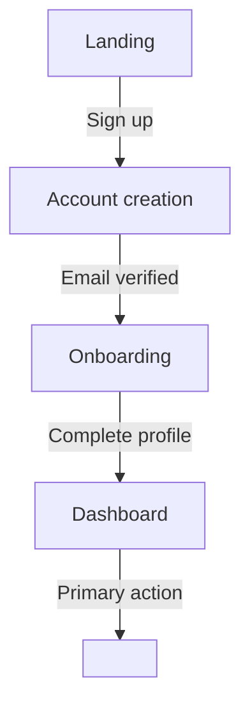

# Visual Sketch (Optional)

Runs once, after Open Questions Compilation and **before** the Final Handoff. Produces two artefacts:

1. **User journey diagram** — a Mermaid flowchart per selected persona.
2. **UI mockups** — one self-contained HTML file per screen, plus an `index.html` hub.

This stage is **opt-in**. Default is to skip. Visuals are a sidecar — they live under `Product-Definition/visual/` and are not part of the formal AI-DLC handoff contract.

---

## Step 0 — Prompt the user (always)

Before generating anything, ask the user whether they want to run this stage. Write a single question into `Product-Definition/interview/visual-prompt.md`:

```markdown
# Visual Sketch — Optional

Now that the documents are approved, you can optionally generate a visual
sketch of the product: a user-journey flowchart and lightweight HTML mockups
of the main screens. Adds ~10–15 min.

A) Yes — generate the user journey + HTML mockups
B) No — skip and go straight to the AI-DLC handoff

[Answer]:
```

Wait for the user to reply `ready` (or the localised equivalent — see `common/language-handling.md`). Re-read the file. Then:

- **B** → log the choice in `audit.md` (stage `Visual Sketch — Skipped`), delete `Product-Definition/interview/visual-prompt.md`, proceed to Final Handoff.
- **A** → continue with Step 1.

Update `aidlc-discovery-state.md`:

```markdown
## Visual Sketch
- Status: <Skipped | In Progress | ✅ Complete | ⏸ Paused>
- Started: <ISO8601>
```

## Step 1 — Mini-interview (5 questions)

Write the following batch into `Product-Definition/interview/visual/visual-questions.md`. Render in the user's language (see `common/language-handling.md`). Per-question state tracked in `aidlc-discovery-state.md` under `## Visual Questions` as `[ ] V1`…`[ ] V5`.

```markdown
# Visual Sketch — Questions (5)

Progress: [□□□□□] 0/5  (~12 min remaining)

## V1) Which persona(s) should the user journey follow?

(Personas were declared in the Vision Document. Pick one or more.)

A) <persona 1 name from Vision>
B) <persona 2 name from Vision>
C) ...
X) Other (describe after [Answer]:)

[Answer]:

## V2) How deep should the user journey be?

A) Happy path only — single linear flow, ~5 nodes (~10 min)
B) Happy path + 1–2 error or alternative paths, ~8 nodes (~14 min)
X) Custom — describe after [Answer]:

[Answer]:

## V3) What visual style should the mockups use?

A) Wireframe — boxes and labels, no color, lowest interpretation risk
B) Lo-fi styled — neutral Tailwind defaults, no brand colors
C) Branded — provide 2–3 brand colors (hex) and an optional logo URL or path

[Answer]:

## V4) What kind of sample data should appear?

A) Realistic — drawn from the Vision (product names, persona names)
B) Lorem ipsum / placeholders only — safest if the Vision is sensitive

[Answer]:

## V5) Which viewport(s) should the mockups target?

A) Desktop (1280×800)
B) Mobile (390×844)
C) Both — same screens generated twice, one set per viewport

[Answer]:

---

Reply `ready` when all 5 answers are filled.
```

Wait for `ready`, re-read, validate per `common/content-validation.md`, append a single block to `Product-Definition/interview/visual/visual-answers-history.md`, tick all five state checkboxes.

## Step 2 — Generation (delegated to the agent)

The agent now produces the visuals. Follow this exact order — do not reorder.

### 2a. Read context

Read in this order:
1. `Product-Definition/vision-document.md` — primary source for personas, features, primary actions, terminology.
2. `Product-Definition/technical-environment.md` (if it exists) — informs anything visible to the user (auth choice, multi-language, accessibility constraints).
3. `Product-Definition/interview/visual/visual-answers-history.md` — the 5 answers.

### 2b. Generate the user journey first

Write `Product-Definition/visual/user-journey.md`. One Mermaid `flowchart TD` per selected persona. Format:

```markdown
# User Journey — <Project Name>

## Persona: <name from Vision>


```

Rules:
- Every node must correspond to a screen the user sees (no abstract "system" nodes).
- Every edge label must be a user action (verb phrase).
- Number of nodes capped per V2 answer: A → 5 max, B → 8 max, X → user-described.
- If V1 selected multiple personas, generate one flowchart per persona.

### 2c. Derive the screen list

The screen list is exactly the set of unique nodes across all journeys. Do not invent screens. Order them by first appearance in the happy path. Number them `01`, `02`, … with a kebab-case slug.

### 2d. Generate one HTML mockup per screen

Write each as a self-contained file in `Product-Definition/visual/mockups/`. Use this skeleton:

```html
<!doctype html>
<html lang="<user-language-code>">
<head>
  <meta charset="utf-8">
  <meta name="viewport" content="width=<viewport-width>, initial-scale=1">
  <title><Project Name> — <Screen Name></title>
  <script src="https://cdn.tailwindcss.com"></script>
</head>
<body class="bg-slate-50 min-h-screen">
  <div class="bg-amber-200 text-amber-900 text-center py-1 text-sm font-medium">
    🎨 MOCKUP — not functional · Generated by aidlc-discovery
  </div>

  <!-- Consistent header/nav across all screens -->
  <header class="bg-white border-b border-slate-200">
    <div class="max-w-6xl mx-auto px-4 py-3 flex items-center justify-between">
      <span class="font-semibold"><Project Name></span>
      <nav class="text-sm text-slate-600">...</nav>
    </div>
  </header>

  <main class="max-w-6xl mx-auto px-4 py-8">
    <!-- Screen content based on the journey node and the Vision feature it represents -->
  </main>

  <footer class="text-xs text-slate-500 text-center py-4 mt-12 border-t">
    <a href="../user-journey.md" class="underline">View user journey</a> ·
    <a href="index.html" class="underline">All screens</a>
  </footer>
</body>
</html>
```

Hard rules for every mockup:

1. **Self-contained.** Tailwind via the CDN script is the only external dependency. No other JS, no fetched fonts, no remote images (except a logo URL if the user provided one in V3-C).
2. **No business logic.** A button labelled "Process payment" must not implement anything. Navigation only — every primary CTA is an `<a href="<next-screen>.html">`.
3. **Banner present.** The amber "MOCKUP — not functional" strip is mandatory at the very top of `<body>`.
4. **Primary CTA matches the journey.** The button/link wording on each screen must reuse the verb of the outgoing edge in the journey (e.g. journey edge `Sign up` → screen has a `Sign up` CTA linking to the next file).
5. **Sample data consistency.** If V4 = realistic, every name, product, and value traces to a Vision section. Add an HTML comment near the data: `<!-- source: Vision §Personas -->`. If V4 = placeholder, no realistic name may appear.
6. **Style consistency.** All mockups use the same header, the same colour palette (per V3), the same spacing scale. If V3 = Wireframe, no colour beyond grayscale.
7. **Viewport.** If V5 = Desktop, use `width=1280`. If Mobile, `width=390`. If Both, write each screen twice into `mockups/desktop/` and `mockups/mobile/`.
8. **Accessibility floor.** Every interactive element has a discernible label. Contrast at WCAG AA at minimum.

### 2e. Generate the index hub

Write `Product-Definition/visual/mockups/index.html`. It lists every screen with a click-through link, grouped by persona if multiple. Same skeleton as the screens (banner, header, footer). Use a simple grid of cards — one per screen, in journey order.

### 2f. Resulting structure

```
Product-Definition/
├── visual/                            # output — referenced from the AI-DLC handoff
│   ├── user-journey.md
│   └── mockups/
│       ├── index.html
│       ├── 01-<slug>.html
│       ├── 02-<slug>.html
│       └── ...
└── interview/visual/                  # workspace — process artefacts
    ├── visual-questions.md
    └── visual-answers-history.md
```

If V5 = Both, replace the flat `mockups/` layout with `mockups/desktop/…` and `mockups/mobile/…`, plus a single top-level `index.html` linking to both viewport indexes.

## Step 3 — Validate before presenting the gate

Apply the cross-checks below. If any fails, do not present the gate — fix and re-validate.

| Check | Rule |
|---|---|
| Journey ↔ screen list | Every flowchart node has exactly one HTML file. No HTML file exists without a corresponding node. |
| Edge ↔ CTA | Every outgoing edge from a node maps to an `<a href>` on that node's HTML file with matching verb wording. |
| Banner | The `🎨 MOCKUP — not functional` strip is the first child of `<body>` in every HTML file. |
| Self-contained | No `<script>` / `<link>` other than the Tailwind CDN tag (and the optional user-supplied logo URL). |
| Sample data | If V4 = realistic, every visible string traces to a Vision section via HTML comment. If V4 = placeholder, no realistic name appears. |
| Style | All mockups use the same header markup. No colour outside the chosen palette. |
| Vision-only features | No screen depicts a feature that is not in the Vision Document. |
| Index | `index.html` lists every screen and the count matches the unique-node count from the journey. |

## Step 4 — Present the gate

```
Visual Sketch ready — review before we hand off.

  Product-Definition/visual/user-journey.md          (Mermaid flowchart)
  Product-Definition/visual/mockups/index.html       (start here)
  Product-Definition/visual/mockups/01-<slug>.html
  Product-Definition/visual/mockups/02-<slug>.html
  ...

Summary
───────
  Persona(s):  <from V1>
  Depth:       <from V2>
  Style:       <from V3>
  Sample data: <from V4>
  Viewport:    <from V5>
  Screens:     <count>

Your options:

  1) Request Changes — name the screen and tell me what to fix; I'll
     regenerate just that file (and the journey if the structure changed).

  2) Approve and Continue — mark Visual Sketch as ✅ complete and move
     to the AI-DLC handoff.

  3) Discard and Skip — remove Product-Definition/visual/ entirely
     and go straight to the handoff.

What would you like to do?
```

Wait for the user's explicit choice.

## Step 5 — Handle the gate response

- **Request Changes** → identify the screen(s) and the specific fix. Append a correction note to `visual-answers-history.md`. Regenerate only the affected HTML files and (if structure changed) the journey. Re-validate. Re-present the gate.
- **Approve and Continue**:
  1. Update state:
     ```markdown
     ## Visual Sketch
     - Status: ✅ Complete (approved <ISO8601>)
     ```
  2. Log approval in `audit.md` with stage `Visual Sketch — Completion`.
  3. Proceed to Final Handoff.
- **Discard and Skip**:
  1. Delete `Product-Definition/visual/` AND `Product-Definition/interview/visual/` entirely.
  2. Update state status to `Discarded`.
  3. Log in `audit.md` with stage `Visual Sketch — Discarded` and the user's reason if given.
  4. Proceed to Final Handoff.

## Fallback for agents without HTML write capability

If the agent cannot write HTML files (rare — applies to some web-only chat assistants):

1. Write the journey to `user-journey.md` as Mermaid (universal).
2. Write `mockups.md` containing one ASCII wireframe block per screen, plus a markdown description of layout, primary CTA, and sample data per screen.
3. Note the fallback in `audit.md`.
4. Present a simplified gate referencing the markdown files only.

This preserves the contract (one node = one screen, primary CTA matches edge, banner stated as text) without requiring file write of `.html`.

## Re-running this stage

If the user later re-opens Business or Technical and changes answers that affect personas, features, or primary actions, the visuals may go stale.

- Detect this on the next workflow turn: any change to `vision-answers-history.md` or `tech-env-answers-history.md` after the Visual Sketch approval timestamp.
- Flag in the resume summary: `⚠ Visuals may be stale — Vision/Tech Env updated on <date>.`
- Offer to regenerate or keep as-is. Do not auto-regenerate.

## Audit

Every interaction in this stage is logged per `common/audit-format.md`. Log:
- The opt-in question and the user's choice.
- Each batch write (V1–V5 question file, journey file, each mockup file).
- The validation result.
- The gate decision.
