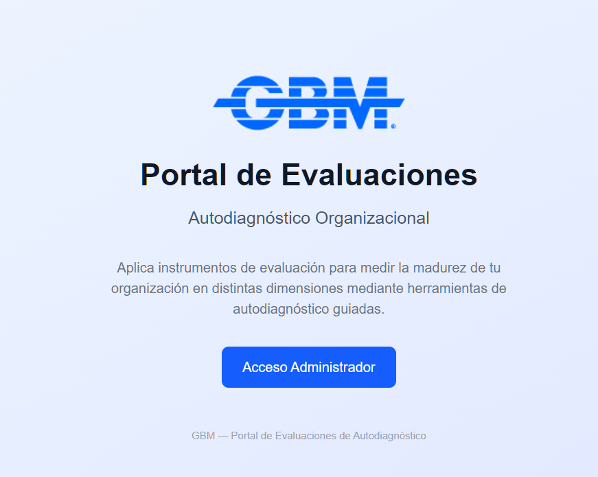

# Portal de Evaluaciones de Autodiagnóstico — GBM

Portal web multi-instrumento para evaluaciones de autodiagnóstico organizacional. Permite aplicar distintos instrumentos de evaluación, gestionar sesiones con participantes, visualizar resultados con gráficos de radar, y generar análisis interpretativos con inteligencia artificial.



## Funcionalidades Principales

### Para el Encuestado
- Acceso mediante enlace público o código QR (sin login)
- Registro con nombre y correo electrónico
- Encuesta tipo wizard/stepper con barra de progreso
- Escala 1-5 con etiquetas personalizables por instrumento (tooltip en cada valor)
- Navegación adelante/atrás entre dimensiones
- Reanudación si no completó la encuesta
- Visualización inmediata de resultados (gráfico de radar + tabla de madurez)

### Para el Administrador
- Dashboard global con métricas (sesiones, respuestas, tiempo promedio, instrumentos)
- Gestión de sesiones (crear, habilitar, deshabilitar, eliminar)
- Dashboard por sesión con métricas específicas
- Vista individual y consolidada de resultados
- Análisis IA interpretativo bajo demanda (Gemini / Groq)
- Exportar resultados a Excel (.xlsx)
- Código QR generado por sesión
- Gestión de instrumentos de evaluación (multi-instrumento con feature flag)
- Import/Export del banco de preguntas via Excel
- Versionamiento automático del banco (solo si hay respuestas)
- Etiquetas de escala personalizables por instrumento
- Niveles de madurez configurables (umbrales, labels y colores editables por instrumento)
- Expertise de IA configurable por instrumento

## Stack Tecnológico

| Capa | Tecnología |
|------|------------|
| Framework | Next.js 16 (App Router) |
| Lenguaje | TypeScript |
| UI | React 19 + Tailwind CSS 4 |
| Visualización | Recharts (radar chart) |
| Exportación | ExcelJS |
| IA/Análisis | Google Gemini 2.0 Flash + Groq Llama 3.3 70B (fallback) |
| Backend/DB | Supabase (PostgreSQL + Auth + RLS) |
| Feature Flags | Env var (NEXT_PUBLIC_MULTI_INSTRUMENT) |
| Despliegue | Vercel (frontend) + Supabase Cloud (BD) |

## Requisitos Previos

- [Node.js](https://nodejs.org/) (v18+)
- [Supabase CLI](https://supabase.com/docs/guides/cli)
- [Docker](https://www.docker.com/) (para Supabase local)

## Instalación

```bash
# Clonar el repositorio
git clone https://github.com/openGBM/gbm-easd.git
cd gbm-easd

# Iniciar Supabase local
supabase start

# Instalar dependencias
cd portal-ea
npm install

# Configurar variables de entorno
# Crear .env.local con las credenciales
cp .env.local.example .env.local
# Editar con credenciales de Supabase local

# Iniciar servidor de desarrollo
npm run dev
```

## Variables de Entorno

```env
NEXT_PUBLIC_SUPABASE_URL=http://127.0.0.1:54321
NEXT_PUBLIC_SUPABASE_ANON_KEY=<tu-anon-key>
ADMIN_EMAILS=admin@gbm.net
GEMINI_API_KEY=<api-key-google-ai-studio>
GROQ_API_KEY=<api-key-groq>
NEXT_PUBLIC_MULTI_INSTRUMENT=true
```

## Estructura del Proyecto

```
gbm-easd/
├── portal-ea/               # Aplicación Next.js
│   └── src/
│       ├── app/             # Páginas (App Router)
│       ├── components/      # Componentes reutilizables
│       ├── lib/             # Cliente Supabase
│       ├── types/           # Tipos TypeScript
│       └── flags.ts         # Feature flags
├── supabase/                # Configuración Supabase + Migraciones
│   ├── config.toml
│   └── migrations/          # 6 migraciones SQL
├── docs/                    # Documentación
│   ├── vision.md            # Visión del producto
│   ├── manual-administrador.md  # Manual de usuario
│   └── analisis-critico.md  # Análisis técnico + roadmap
├── aidlc-docs/              # Documentación AI-DLC
│   ├── inception/           # Requerimientos, diseño de app
│   └── construction/        # Diseño funcional, reglas de negocio
└── examples/                # Ejemplos de uso
```

## Modelo de Datos

| Tabla | Descripción |
|-------|-------------|
| `sessions` | Sesiones de evaluación |
| `dimensions` | Dimensiones por versión de instrumento |
| `questions` | Preguntas por dimensión |
| `respondents` | Encuestados (nombre, correo, completado) |
| `responses` | Respuestas (valor 1-5) |
| `session_analyses` | Análisis IA por sesión |
| `instruments` | Instrumentos de evaluación |
| `instrument_versions` | Versiones del banco (scale_labels, maturity_levels) |

## Documentación

- [Manual del Administrador](docs/manual-administrador.md)
- [Visión del Producto](docs/vision.md)
- [Análisis Crítico y Roadmap](docs/analisis-critico.md)
- [Requerimientos](aidlc-docs/inception/requirements/requirements.md)
- [Diseño Multi-Instrumento](aidlc-docs/inception/application-design/v2-multi-instrument-design.md)

## Roadmap

- [x] v1.0 — MVP: Encuesta EA, radar, admin básico
- [x] v1.1 — Análisis IA, export Excel, dashboards
- [x] v1.2 — Multi-instrumento, versionamiento, import/export Excel, escalas y niveles configurables
- [ ] v2.1 — Editor visual de preguntas (sin depender de Excel), filtros en listado de sesiones
- [ ] v2.2 — Notificaciones por email, dashboard histórico con tendencias
- [ ] v3.0 — Escalas configurables (no solo 1-5), tipos de pregunta variados
- [ ] v4.0 — Multi-tenant, roles granulares, SSO, OpenTelemetry, middleware server-side

## Licencia

Proyecto interno de GBM. Todos los derechos reservados.
