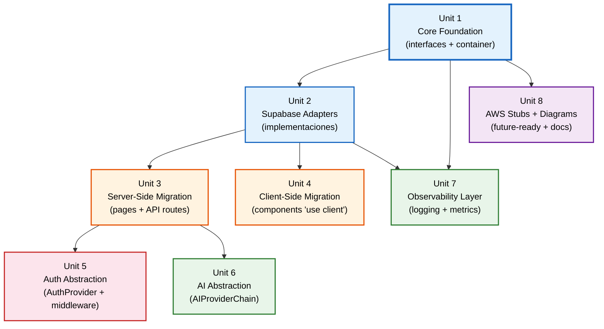

# Dependencias entre Unidades de Trabajo — Abstracción Arquitectónica v3.1

## Matriz de Dependencias

| Unit | Depende de | Es dependencia de |
|------|-----------|-------------------|
| 1 - Core Foundation | — | 2, 3, 4, 5, 6, 7, 8 (todas) |
| 2 - Supabase Adapters | 1 | 3, 4, 7 |
| 3 - Server-Side Migration | 1, 2 | 5, 6 |
| 4 - Client-Side Migration | 1, 2 | — |
| 5 - Auth Abstraction | 1, 3 | — |
| 6 - AI Abstraction | 1, 3 | — |
| 7 - Observability Layer | 1, 2 | — |
| 8 - AWS Stubs + Diagrams | 1 | — |

---

## Grafo de Dependencias



---

## Critical Path

El camino más largo (critical path) determina la duración mínima de ejecución secuencial:

```
Unit 1 → Unit 2 → Unit 3 → Unit 5 (Auth)
                                    4 units en secuencia
```

**Duración mínima**: 4 units en secuencia si se ejecuta serialmente.

---

## Oportunidades de Paralelismo

| Grupo Paralelo | Units | Requisito previo |
|----------------|-------|-----------------|
| A | Unit 3 + Unit 4 | Unit 1 + Unit 2 completadas |
| B | Unit 5 + Unit 6 | Unit 3 completada |
| C | Unit 7 + Unit 8 | Unit 1 (+ Unit 2 para Unit 7) completadas |

**Con paralelismo máximo, la duración se reduce a ~5 pasos:**
1. Unit 1
2. Unit 2 + Unit 8 (paralelo)
3. Unit 3 + Unit 4 + Unit 7 (paralelo)
4. Unit 5 + Unit 6 (paralelo)
5. Integración final + Build & Test

---

## Contratos entre Units

| Interface/Contrato | Productor (Unit) | Consumidor(es) (Unit) |
|--------------------|-------------------|----------------------|
| Repository interfaces (ports) | 1 | 2, 3, 4, 7, 8 |
| Auth interfaces (ports) | 1 | 5 |
| AI interfaces (ports) | 1 | 6 |
| DomainError + Result types | 1 | 2, 3, 4, 5, 6, 7, 8 |
| ServiceToken definitions | 1 | 2, 3, 4, 5, 6, 7 |
| Container (server/client) | 1 | 3, 4, 5, 6, 7 |
| SupabaseXxxRepository implementations | 2 | 3, 4, 7 (vía Container) |
| Supabase client factories | 2 | 3, 4, 5 (vía Container) |
| InstrumentedRepository decorator | 7 | 3, 4 (vía Container wrapping) |

---

## Estrategia de Rollback por Unit

| Unit | Rollback Strategy | Complejidad |
|------|-------------------|-------------|
| 1 | Eliminar `core/` directory | Trivial (sin consumidores) |
| 2 | Eliminar `core/adapters/supabase/` | Trivial (sin consumidores) |
| 3 | Revert git de archivos server modificados | Simple (restore originals) |
| 4 | Revert git de archivos client modificados | Simple (restore originals) |
| 5 | Revert proxy.ts + login + AdminNav | Medio (auth es sensible) |
| 6 | Revert /api/analysis/route.ts | Simple (un archivo) |
| 7 | Eliminar observability + revert containers | Simple |
| 8 | Eliminar `core/adapters/aws/` + drawio files | Trivial |

---

## Validación de Integridad entre Units

| Checkpoint | Después de Unit | Validación |
|-----------|-----------------|------------|
| Types compile | 1 | `tsc --noEmit` — zero errors |
| Adapters pass contracts | 2 | `vitest run --filter contract` |
| Server pages work | 3 | `playwright test` — all passing |
| Client components work | 4 | `playwright test` — all passing |
| Auth flow works | 5 | `playwright test e2e/admin-flow` |
| AI analysis works | 6 | `playwright test` + manual verification |
| Metrics available | 7 | `curl /api/metrics` returns Prometheus format |
| Contract tests AWS | 8 | `vitest run --filter contract` passes for stubs |
| **Final integration** | ALL | Full `playwright test` + `vitest run` + `tsc --noEmit` |
