# Plan de Ejecución — Abstracción Arquitectónica v3.1

## Resumen del Análisis Detallado

### Alcance de la Transformación
- **Tipo de transformación**: Refactoring arquitectónico system-wide
- **Cambios primarios**: Introducir capas de abstracción (Ports & Adapters / Hexagonal Architecture)
- **Componentes afectados**: 15+ archivos con dependencia directa a Supabase + 1 API route con dependencia a Gemini/Groq

### Evaluación de Impacto

| Área | Impacto | Descripción |
|------|---------|-------------|
| User-facing | No | Refactoring 100% interno, UX intacta |
| Structural | Sí | Nueva estructura `core/` con ports, adapters, container |
| Data model | No | El schema de BD no cambia |
| API changes | No | Los contratos de API routes se mantienen |
| NFR impact | Sí | Agrega observabilidad, mejora testability y maintainability |

### Relaciones de Componentes

```
┌─────────────────────────────────────────────────────────┐
│                    CONSUMERS                            │
│  app/pages → app/api routes → components (client)       │
└─────────────────────┬───────────────────────────────────┘
                      │ importan
                      ▼
┌─────────────────────────────────────────────────────────┐
│              core/container.ts (DI)                     │
│  Resuelve: Repositories + AuthProvider + AIProvider     │
└──────┬──────────────────┬──────────────────┬────────────┘
       │                  │                  │
       ▼                  ▼                  ▼
┌──────────────┐  ┌──────────────┐  ┌──────────────┐
│ core/ports/  │  │ core/ports/  │  │ core/ports/  │
│ repositories │  │ auth         │  │ ai           │
│ (interfaces) │  │ (interfaces) │  │ (interfaces) │
└──────┬───────┘  └──────┬───────┘  └──────┬───────┘
       │                 │                 │
       ▼                 ▼                 ▼
┌──────────────┐  ┌──────────────┐  ┌──────────────┐
│  adapters/   │  │  adapters/   │  │  adapters/   │
│  supabase/   │  │  supabase/   │  │  ai/         │
│  (actual)    │  │  auth(actual)│  │gemini + groq │
└──────────────┘  └──────────────┘  └──────────────┘
       │                  │                  │
       ▼                  ▼                  ▼
┌──────────────┐  ┌──────────────┐  ┌──────────────┐
│  adapters/   │  │  adapters/   │  │  adapters/   │
│  aws/ (fut.) │  │  aws/cognito │  │  aws/bedrock │
│  (futuro)    │  │  (futuro)    │  │  (futuro)    │
└──────────────┘  └──────────────┘  └──────────────┘
```

### Evaluación de Riesgo
- **Nivel de riesgo**: Medio
- **Complejidad de rollback**: Baja (cada fase es independiente, se puede revertir git)
- **Complejidad de testing**: Alta (unitarios + contracts + PBT + E2E)

---

## Visualización del Workflow

```mermaid
flowchart TD
    Start(["Solicitud: Abstracción Arquitectónica v3.1"])
    
    subgraph INCEPTION["🔵 INCEPTION PHASE"]
        WD["Workspace Detection<br/><b>COMPLETADO</b>"]
        RA["Requirements Analysis<br/><b>COMPLETADO</b>"]
        WP["Workflow Planning<br/><b>EN CURSO</b>"]
        AD["Application Design<br/><b>EJECUTAR</b>"]
        UG["Units Generation<br/><b>EJECUTAR</b>"]
    end
    
    subgraph CONSTRUCTION["🟢 CONSTRUCTION PHASE"]
        FD["Functional Design<br/>(per-unit)<br/><b>EJECUTAR</b>"]
        NFRA["NFR Requirements<br/><b>EJECUTAR</b>"]
        NFRD["NFR Design<br/><b>EJECUTAR</b>"]
        ID["Infrastructure Design<br/><b>EJECUTAR</b>"]
        CG["Code Generation<br/>(per-unit)<br/><b>EJECUTAR</b>"]
        BT["Build and Test<br/><b>EJECUTAR</b>"]
    end
    
    Start --> WD
    WD --> RA
    RA --> WP
    WP --> AD
    AD --> UG
    UG --> FD
    FD --> NFRA
    NFRA --> NFRD
    NFRD --> ID
    ID --> CG
    CG --> BT
    BT --> End(["Completo"])
    
    style WD fill:#4CAF50,stroke:#1B5E20,stroke-width:3px,color:#fff
    style RA fill:#4CAF50,stroke:#1B5E20,stroke-width:3px,color:#fff
    style WP fill:#4CAF50,stroke:#1B5E20,stroke-width:3px,color:#fff
    style AD fill:#FFA726,stroke:#E65100,stroke-width:3px,stroke-dasharray: 5 5,color:#000
    style UG fill:#FFA726,stroke:#E65100,stroke-width:3px,stroke-dasharray: 5 5,color:#000
    style FD fill:#FFA726,stroke:#E65100,stroke-width:3px,stroke-dasharray: 5 5,color:#000
    style NFRA fill:#FFA726,stroke:#E65100,stroke-width:3px,stroke-dasharray: 5 5,color:#000
    style NFRD fill:#FFA726,stroke:#E65100,stroke-width:3px,stroke-dasharray: 5 5,color:#000
    style ID fill:#FFA726,stroke:#E65100,stroke-width:3px,stroke-dasharray: 5 5,color:#000
    style CG fill:#4CAF50,stroke:#1B5E20,stroke-width:3px,color:#fff
    style BT fill:#4CAF50,stroke:#1B5E20,stroke-width:3px,color:#fff
    style Start fill:#CE93D8,stroke:#6A1B9A,stroke-width:3px,color:#000
    style End fill:#CE93D8,stroke:#6A1B9A,stroke-width:3px,color:#000
    style INCEPTION fill:#BBDEFB,stroke:#1565C0,stroke-width:3px,color:#000
    style CONSTRUCTION fill:#C8E6C9,stroke:#2E7D32,stroke-width:3px,color:#000
    
    linkStyle default stroke:#333,stroke-width:2px
```



---

## Fases a Ejecutar

### 🔵 INCEPTION PHASE
- [x] Workspace Detection (COMPLETADO)
- [x] Requirements Analysis (COMPLETADO)
- [ ] User Stories — **SKIP**
  - **Razón**: Refactoring interno sin impacto en UX ni nuevos user journeys
- [x] Workflow Planning (EN CURSO)
- [ ] Application Design — **EJECUTAR**
  - **Razón**: Se necesitan definir nuevos componentes (ports, adapters, container, observability), sus relaciones, y las interfaces de servicio
- [ ] Units Generation — **EJECUTAR**
  - **Razón**: Descomponer el refactoring en unidades desplegables independientemente. Cada unit es un incremento funcional que se puede deployar sin romper el sistema.

### 🟢 CONSTRUCTION PHASE
- [ ] Functional Design — **EJECUTAR** (per-unit)
  - **Razón**: Definir contratos de las interfaces, domain errors, y business rules de la capa de abstracción por cada unit. PBT-01 requiere identificar propiedades testables aquí.
- [ ] NFR Requirements — **EJECUTAR**
  - **Razón**: Definir requirements de observabilidad (RESILIENCY-05), health checks (RESILIENCY-06), timeouts (RESILIENCY-10), y framework PBT (PBT-09)
- [ ] NFR Design — **EJECUTAR**
  - **Razón**: Diseñar patrones de observabilidad (decorator), circuit breaking, graceful degradation, y estructura de metrics. Resiliency extension lo requiere.
- [ ] Infrastructure Design — **EJECUTAR**
  - **Razón**: Comparación formal Supabase vs AWS, documentar decisiones de infraestructura, mapear servicios equivalentes, generar diagramas .drawio.
- [ ] Code Generation — **EJECUTAR** (per-unit, siempre)
  - **Razón**: Implementación de cada unit como entrega desplegable
- [ ] Build and Test — **EJECUTAR** (siempre)
  - **Razón**: Instrucciones de build, test unitarios, contract tests, PBT, E2E

### 🟡 OPERATIONS PHASE
- [ ] Operations — PLACEHOLDER

---

## Justificación de Stages EJECUTAR vs SKIP

| Stage | Decisión | Razón principal |
|-------|----------|-----------------|
| User Stories | SKIP | Refactoring interno, sin nuevos user journeys |
| Application Design | EJECUTAR | Nuevos componentes: 11 ports, 3 providers, DI container, observability layer |
| Units Generation | EJECUTAR | Descomponer en unidades desplegables independientemente (cada fase del refactoring = 1 unit) |
| Functional Design | EJECUTAR | Contratos de interfaces, domain errors, PBT properties (PBT-01) — per-unit |
| NFR Requirements | EJECUTAR | Observabilidad, health checks, timeouts (RESILIENCY ext.) |
| NFR Design | EJECUTAR | Decorator pattern, circuit breaking, metrics structure |
| Infrastructure Design | EJECUTAR | Comparación Supabase vs AWS formal + diagramas .drawio |
| Code Generation | EJECUTAR | Implementación de cada unit como entrega desplegable |
| Build and Test | EJECUTAR | Instrucciones completas de testing multi-capa |

---

## Secuencia de Implementación (dentro de Code Generation)

```mermaid
flowchart LR
    F1["Fase 1<br/>Interfaces"]
    F2["Fase 2<br/>Adapters Supabase"]
    F3["Fase 3<br/>Migrar Server"]
    F4["Fase 4<br/>Migrar Client"]
    F5["Fase 5<br/>Auth Provider"]
    F55["Fase 5.5<br/>AI Provider"]
    F6["Fase 6<br/>Observabilidad"]
    F7["Fase 7<br/>AWS Stubs"]
    F8["Fase 8<br/>Diagramas"]
    
    F1 --> F2
    F2 --> F3
    F3 --> F4
    F4 --> F5
    F5 --> F55
    F55 --> F6
    F6 --> F7
    F7 --> F8
    
    style F1 fill:#E3F2FD,stroke:#1565C0,color:#000
    style F2 fill:#E3F2FD,stroke:#1565C0,color:#000
    style F3 fill:#FFF3E0,stroke:#E65100,color:#000
    style F4 fill:#FFF3E0,stroke:#E65100,color:#000
    style F5 fill:#FCE4EC,stroke:#C62828,color:#000
    style F55 fill:#E8F5E9,stroke:#2E7D32,color:#000
    style F6 fill:#E8F5E9,stroke:#2E7D32,color:#000
    style F7 fill:#F3E5F5,stroke:#6A1B9A,color:#000
    style F8 fill:#F3E5F5,stroke:#6A1B9A,color:#000
```



---

## Criterios de Éxito

| Criterio | Métrica |
|----------|---------|
| Cero llamadas directas a Supabase fuera de `core/adapters/supabase/` | grep count = 0 |
| Cero imports de `@supabase/*` fuera de `core/adapters/supabase/` | grep count = 0 |
| Cero imports de `@google/generative-ai` o `groq-sdk` fuera de `core/adapters/ai/` | grep count = 0 |
| TypeScript strict compila sin errores | tsc --noEmit exit 0 |
| E2E tests Playwright pasan sin modificación | playwright test exit 0 |
| Contract tests validan ambas implementaciones (Supabase + AWS stub) | vitest contract exit 0 |
| PBT tests pasan para round-trips y invariantes | vitest pbt exit 0 |
| Bundle size incremento < 10KB gzipped | next build analyze |
| Latencia por operación < 5ms overhead | métricas endpoint |
| $0 costo adicional en infraestructura | sin nuevas suscripciones |

---

## Estimación de Duración

| Fase AI-DLC | Estimación |
|-------------|-----------|
| Application Design | 1 sesión |
| Functional Design | 1 sesión |
| NFR Requirements | 1 sesión |
| NFR Design | 1 sesión |
| Infrastructure Design | 1 sesión |
| Code Generation (Planning) | 1 sesión |
| Code Generation (Fases 1-8) | 3-5 sesiones |
| Build and Test | 1 sesión |
| **Total estimado** | **10-12 sesiones** |
